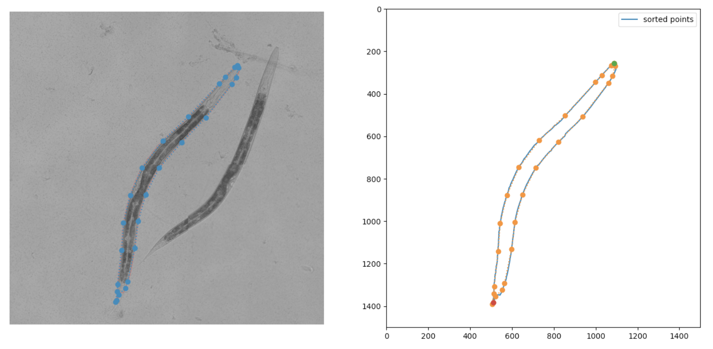

# celegans_img_proc

The goal of this project is to compare and analyze the internal structure of C. elegans across developmental stages. 
C. elegans are transparent roundworms which are ideal for this project since their transparency allows us to be able to easily see their internal organs.
Using brightfield images of these worms, we want to standardize the worms using conformal mapping in order to compare worms of different sizes, shapes, and orientation.
We are using methods similar to that of [this paper](https://arxiv.org/abs/2010.06656), but in Python rather than MATLAB and with worms rather than fruit fly wings.
The full pipeline is split into multiple steps: stitching and background correction, segmentation, boundary identification and spline fitting, and conformal mapping.
The folder in this repo are correspond to these steps/substeps and each step builds on the script of the previous step, with the exception of the stitching and background correction files.

